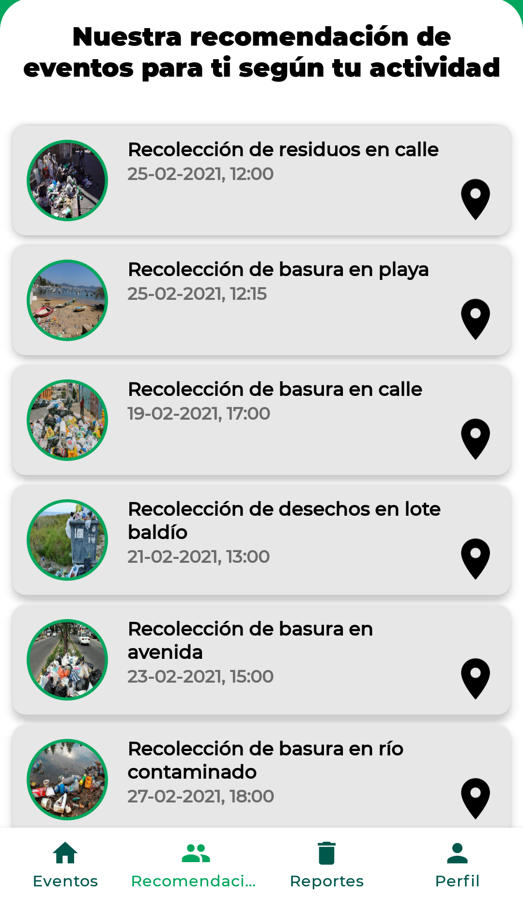

# CuidadoMedioAmbiente
App para dispositivos móviles Android para el reporte y limpieza de puntos de contaminación.

La App esta siendo desarrollada en Java con Android Studio.

## Algunas capturas de la App

